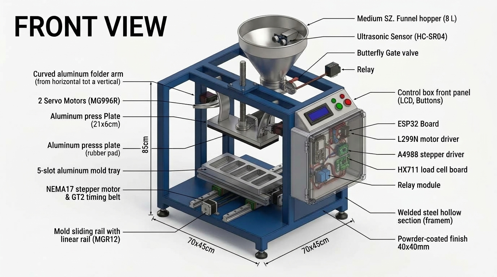
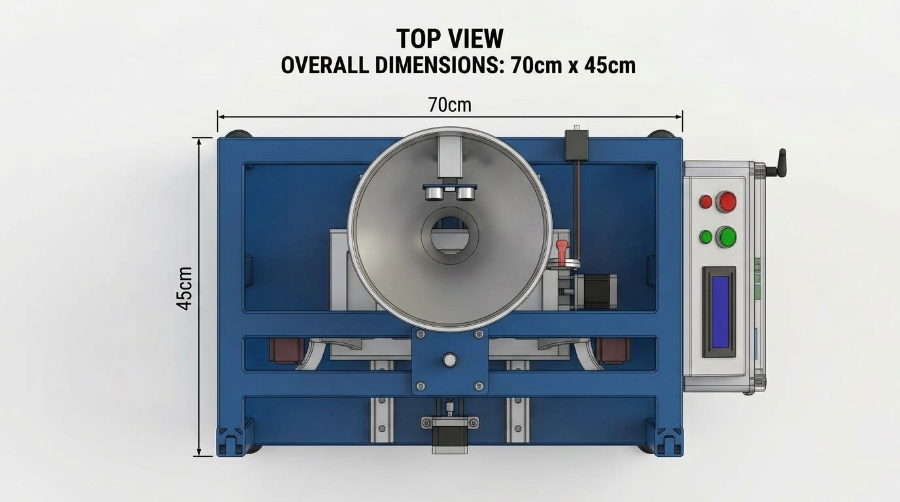

# 🫘 TempehKit &mdash; Mesin Pencetak Tempe Otomatis berbasis IoT
## Desain Final v9 — 6-Slot Simultan, Flip Rotari 180° (Lean Architecture)

[](https://www.espressif.com/)
[](https://www.arduino.cc/)
[]()
[]()
[](LICENSE)

**TempehKit** adalah solusi otomasi pencetakan tempe skala UKM berbasis Internet of Things (IoT). Mesin ini memproses **6 slot tempe secara simultan** per siklus, dilengkapi sistem pengisian corong (*dosing*) 6 nozzle Y-Fork dengan pemantauan berat *real-time* via Load Cell 20kg, penekanan presisi melalui dual *Lead Screw* T8, serta sistem pemindahan hasil cetak ke ancak bambu menggunakan **mekanisme pembalikan rotari 180°** (*rotary flip ejection*) yang digerakkan oleh motor stepper NEMA 23 dan pengunci elektromagnetik 12V. Seluruh proses dan data telemetri dapat dipantau langsung dari smartphone via **Web Dashboard Wi-Fi lokal ESP32**.

<p align="center">
  
  <br>
  <em><strong>Visualisasi CAD Final v9: Mekanisme Cetakan Rotari 180° dengan Stepper NEMA 23, Sabuk HTD3M, dan Poros As Ø20mm</strong></em>
</p>

---

## 📌 PANDUAN KERJA TIM & BLUEPRINT FINAL (ACUAN UTAMA)

Untuk memudahkan pembagian tugas pengadaan, fabrikasi, dan pemrograman, gunakan tiga dokumen acuan berikut:

1. 🛒 **[`docs/bom_belanja.md`](docs/bom_belanja.md) — DAFTAR BELANJA LENGKAP (3 CHANNEL)**
   * Panduan belanja terperinci: Toko Online (Tokopedia/Shopee), Toko Besi & Hardware Lokal, serta Bengkel Las & Fabrikasi Custom SS304.
   * Dilengkapi kata kunci pencarian, spesifikasi teknis, estimasi harga, dan tips negosiasi borongan.

2. 🚀 **[`docs/PROJECT_EXECUTION_PLAN.md`](docs/PROJECT_EXECUTION_PLAN.md) — PANDUAN EKSEKUSI PROYEK (SPRINT 0–5)**
   * Pembagian tugas bertahap: *Sprint 0 (Procurement)*, *Sprint 1 (Mekanik & Rangka 90cm)*, *Sprint 2 (Unit Test Elektronik)*, *Sprint 3 (Integrasi Firmware FSM v9)*, *Sprint 4 (Kalibrasi Dosing)*, hingga *Sprint 5 (Produksi Penuh)*.
   * Dilengkapi checklist siap pakai dan *Acceptance Criteria (Definition of Done)*.

3. 📋 **[`docs/implementation_plan_final.md`](docs/implementation_plan_final.md) — BLUEPRINT TEKNIS ARSITEKTUR FINAL (v9)**
   * Dokumen blueprint komprehensif arsitektur v9 (6 slot simultan, flip 180°, operator lipat manual, pantau visual hopper, monitoring Web Dashboard ESP32).
   * Rincian skematik perkabelan ESP32, tata letak mekanik, dan Finite State Machine (FSM).

4. 📐 **[`docs/dimensi_mekanik.md`](docs/dimensi_mekanik.md) — SPESIFIKASI DIMENSI & GAMBAR KERJA BENGKEL LAS**
   * Ukuran potongan besi hollow 40×40mm untuk rangka lebar 90cm, tinggi 130cm, dudukan bearing as putar Ø20mm, dan bracket NEMA 23.

---

## 📸 Visualisasi Desain CAD Multi-Sudut (v9 Final)

| 1. Isometric 3D View (Rotary Flip) | 2. Detail 6-Slot Mold & Dosing Nozzle |
| :---: | :---: |
|  |  |
| *Perspektif 3D cetakan rotari 6-slot dengan sabuk HTD3M & bracket motor* | *Detail geometri cetakan 6 slot (59.1cm) dengan nozzle pengisian Y-Fork* |

| 3. Front Elevation View (Rangka 90cm) | 4. Top Plan View (Cetakan & Penekan) |
| :---: | :---: |
|  |  |
| *Tampak depan: Rangka lebar 90cm, dual lead screw T8, & corong hopper 6 nozzle* | *Tampak atas: Tata letak cetakan 6 slot, jarak pitch 8.5cm, & jalur transmisi motor* |

---

## ⚙️ Spesifikasi Teknis Mesin (v9 Final)

| Parameter | Spesifikasi Desain |
| :--- | :--- |
| **Kapasitas Cetak** | **6 Slot tempe serentak per siklus** (&plusmn;300–360 tempe/jam) |
| **Dimensi Slot Tempe** | Panjang 21.3 cm &times; Lebar 6.6 cm &times; Tebal 3.6 cm (Standar pasar) |
| **Dimensi Cetakan (SS304)** | Panjang 59.1 cm &times; Lebar 24.0 cm (6 rongga + sekat 1cm + margin 6.75cm) |
| **Dimensi Rangka Utama** | Lebar 90.0 cm &times; Tinggi 130.0 cm &times; Kedalaman 40.0 cm (Besi Hollow 40×40×2mm) |
| **Sistem Dosing Kedelai** | Corong SS304 kapasitas 12kg &bull; 6 Nozzle Y-Fork (pitch 8.5cm) &bull; Solenoid Gate 12V |
| **Sensor Penimbangan** | Load Cell 20kg Bar-Type + Modul ADC 24-bit HX711 |
| **Aktuator Pengepresan** | Motor DC Gearbox 12V High-Torque + Dual Lead Screw T8 (300mm) |
| **Mekanisme Ejeksi ke Ancak**| **Flip Rotari 180°:** Stepper NEMA 23 (1.9Nm) + Belt HTD3M 1:3 + 2× Elektromagnet 12V |
| **Pelipatan Plastik** | Manual oleh operator sebelum menekan START (lebih simpel, hemat Rp 140K) |
| **Antarmuka Lokal** | Tombol START & STOP Fisik &bull; LED Indikator (Hijau & Merah) &bull; Buzzer Aktif 5V |
| **Konektivitas IoT** | Wi-Fi 2.4 GHz &bull; Web Server Mandiri &bull; Responsive Dashboard (Grafik, Kontrol, Kalibrasi) |
| **Catu Daya** | Power Supply Switching 12V 10A (120W) + Step-Down Buck LM2596 (5.05V) |
| **Total Estimasi Anggaran** | **&plusmn; Rp 3.583.000** (Online 801rb + Toko Besi 1.281rb + Bengkel SS 1.175rb + Buffer 326rb) |

---

## 📁 Struktur Direktori Repositori

```
tempehkit/
├── assets/                          # Dokumentasi visual & gambar CAD
│   ├── Fix/                         # Gambar CAD 3D Multi-Sudut v9 Fix
│   │   ├── machine_opsi2_balanced.jpg
│   │   ├── machine_opsi2_exploded_view.jpg
│   │   ├── machine_opsi2_front_view.jpg
│   │   ├── machine_opsi2_left_side_view.jpg
│   │   ├── machine_opsi2_mold_detail.jpg
│   │   ├── machine_opsi2_rear_view.jpg
│   │   ├── machine_opsi2_right_side_view.jpg
│   │   ├── machine_opsi2_side_folding.jpg
│   │   └── machine_opsi2_top_view.jpg
│   ├── mold_rotary_isometric_view.jpg # Visualisasi 3D cetakan rotari NEMA 23 (Hero v9)
│   └── wiring_diagram_esp32.jpg       # Skematik diagram pengkabelan ESP32
├── docs/                            # Dokumentasi teknis & panduan kerja
│   ├── bom_belanja.md               # 🛒 Shopping list 3-channel (Online, Besi, Bengkel)
│   ├── PROJECT_EXECUTION_PLAN.md    # 🚀 Panduan eksekusi sprint 0–5
│   ├── implementation_plan_final.md # 📋 Blueprint arsitektur teknis v9 final
│   ├── dimensi_mekanik.md           # 📐 Gambar kerja dimensi rangka untuk bengkel las
│   ├── Project_Brief_Mesin_Pencetak_Tempe.pdf # PDF Blueprint resmi
│   └── dokumentasi_lengkap.md       # Rangkuman mekatronika
├── firmware/                        # Source code ESP32 & Web Dashboard
│   ├── mesin_tempe/                 # Kode firmware produksi utama
│   │   ├── mesin_tempe.ino          # Program kontrol FSM ESP32 v9.0
│   │   └── data/                    # Aset Web Dashboard SPIFFS
│   │       └── index.html           # UI web dashboard interaktif
│   └── tests/                       # Suite pengujian hardware modular
└── README.md                        # Dokumentasi utama repositori
```

---

## 🔌 Pemetaan Pin ESP32 (v9 Final Lean)

```
GPIO  4  ──► HX711 DOUT (Data Load Cell)
GPIO  5  ──► HX711 SCK (Clock Load Cell)
GPIO 12  ──► TB6600 STEP (Langkah NEMA 23 Flip 180°)
GPIO 14  ──► TB6600 DIR (Arah Putar NEMA 23)
GPIO 13  ──► Relay Solenoid Elektromagnet (Kunci Tutup Cetakan)
GPIO 25  ──► L298N IN1 (Motor DC Press Turun)
GPIO 26  ──► L298N IN2 (Motor DC Press Naik)
GPIO 27  ──► Relay Solenoid Pintu Corong Kedelai (Gate Dosing)
GPIO 32  ──► Limit Switch Atas (Homing & Batas Angkat Press)
GPIO 33  ──► Limit Switch Bawah (Batas Tekanan Press Penuh)
GPIO 34  ──► Tombol Fisik START (Pull-up 10k)
GPIO 35  ──► Tombol Fisik STOP / EMERGENCY (Pull-up 10k)
GPIO  2  ──► LED Hijau (Status Standby / Berjalan)
GPIO 15  ──► LED Merah (Status Alarm Error)
GPIO 23  ──► Buzzer Aktif 5V (Notifikasi Selesai & Alarm)
```

---

## 💻 Library Arduino yang Diperlukan

Buka **Arduino IDE** &rarr; **Sketch** &rarr; **Include Library** &rarr; **Manage Libraries...**, lalu pasang library berikut:

1. **`AccelStepper`** by Mike McCauley (Kontrol akselerasi Stepper NEMA 23)
2. **`HX711`** by bogde (v0.7.5+) (Pembacaan sensor berat Load Cell)
3. **`ArduinoJson`** by Benoit Blanchon (v6.x) (Format data REST API status JSON)
4. *`LiquidCrystal I2C`* by Frank de Brabander (Opsional, hanya jika USE_LCD diaktifkan)

---

## 📄 Lisensi

Proyek ini dilisensikan di bawah [MIT License](LICENSE) &mdash; bebas digunakan, dikembangkan, dan dimodifikasi untuk keperluan industri tempe dan penelitian otomasi pangan.
