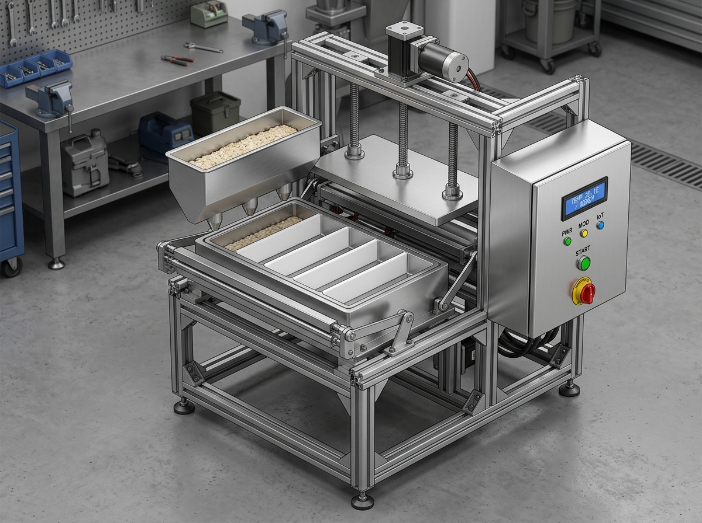
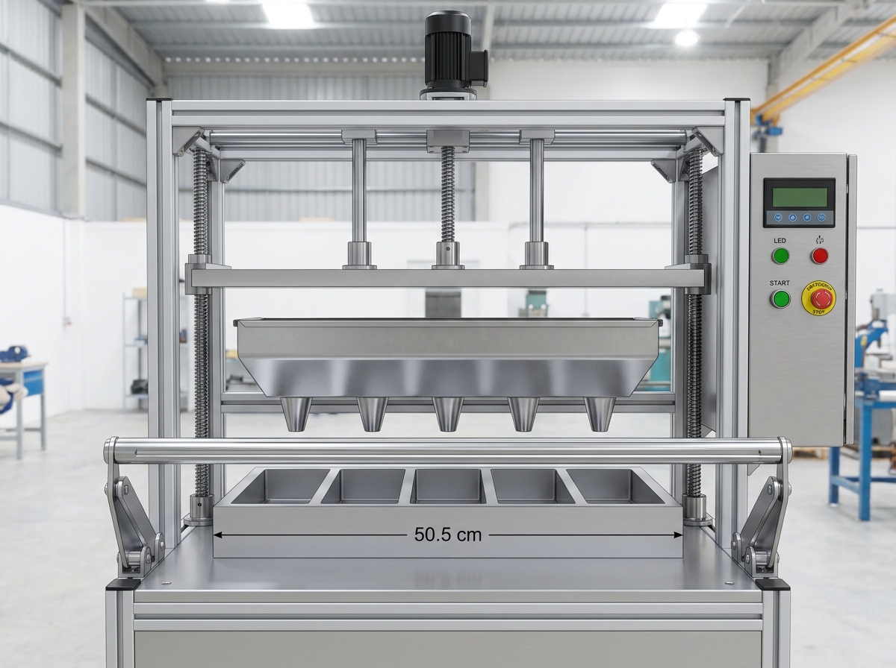
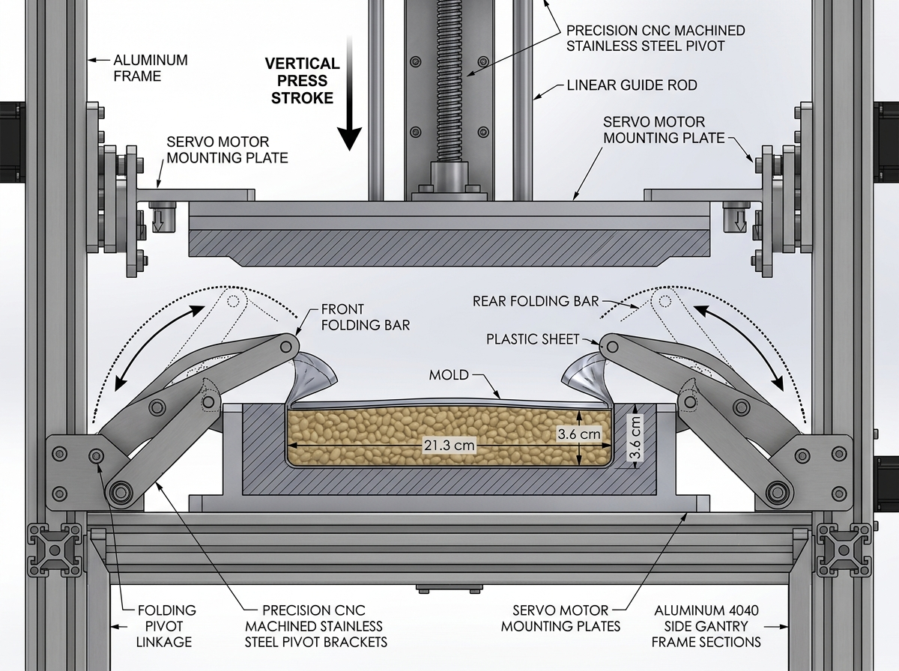
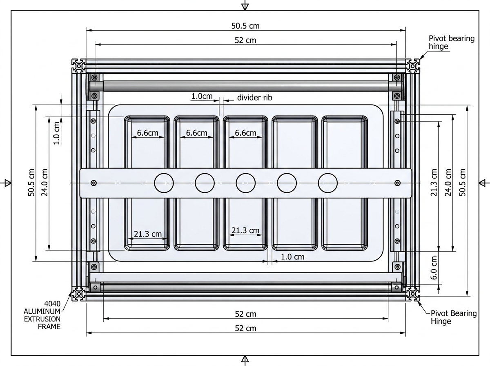
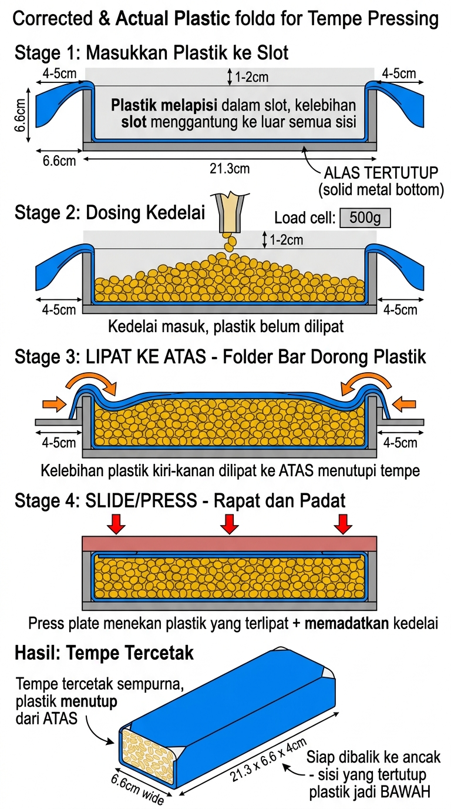
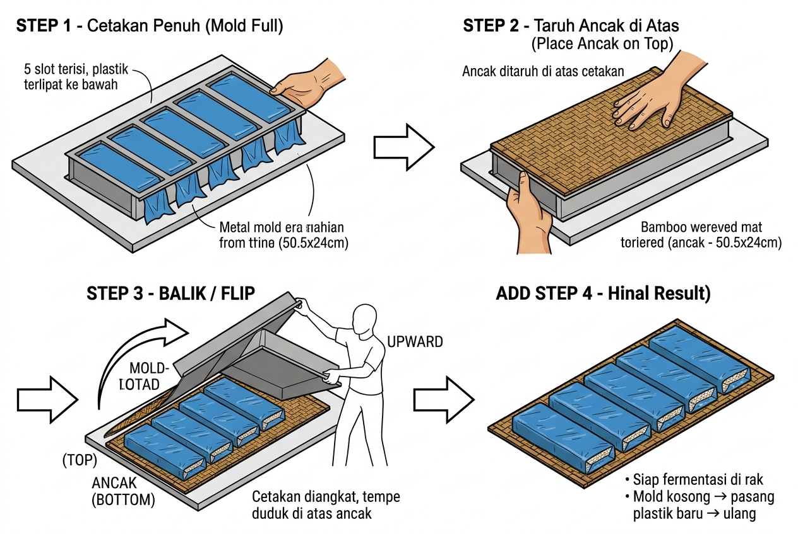

# 🫘 TempehKit &mdash; Mesin Pencetak Tempe Otomatis berbasis IoT

[](https://www.espressif.com/)
[](https://www.arduino.cc/)
[]()
[]()
[](LICENSE)

**TempehKit** adalah solusi otomasi pencetakan tempe berbasis Internet of Things (IoT) yang dirancang untuk mentransformasi proses produksi di pabrik tempe UKM / keluarga. Sistem ini mengintegrasikan mikrokontroler **ESP32**, sistem dosing hopper multi-slot, pelipat plastik simultan, penekanan bermotor *Lead Screw*, dan pemantauan lokal via *Web Dashboard Wi-Fi*.

---

## 📌 PANDUAN KERJA TIM & BLUEPRINT FINAL (BACA INI DULU)

Untuk memudahkan pembagian tugas dan implementasi langsung di lapangan, silakan langsung merujuk ke dua dokumen utama berikut:

1. 🚀 **[`docs/PROJECT_EXECUTION_PLAN.md`](docs/PROJECT_EXECUTION_PLAN.md) — PANDUAN EKSEKUSI PROYEK (SPRINT 0–4)**
   * **Wajib dibaca oleh rekan kerja/tim pelaksana.**
   * Pembagian tugas terstruktur dari *Sprint 0 (Procurement & Belanja)*, *Sprint 1 (Bench-Test Elektronik)*, *Sprint 2 (Fabrikasi Mekanik)*, *Sprint 3 (Integrasi)*, hingga *Sprint 4 (Uji Produksi Nyata)*.
   * Dilengkapi checklist siap pakai, *Acceptance Criteria*, dan SOP penanganan kendala.

2. 📋 **[`docs/implementation_plan_final.md`](docs/implementation_plan_final.md) — BLUEPRINT TEKNIS ARSITEKTUR FINAL (v8)**
   * **Arsitektur Final: 5-Slot Serentak (Simultan)** — seluruh 5 slot didosing, dilipat plastiknya, dan dipress bersamaan tanpa rel geser (lebih cepat & hemat Rp 319.000).
   * Rincian Bill of Materials (BOM), skematik perkabelan ESP32, tata letak mekanik, dan logika firmware.

---

## 📸 Visualisasi Desain CAD Multi-Sudut (Tier 2 Final)

| 1. Isometric 3D View | 2. Front Elevation View |
| :---: | :---: |
|  |  |
| *Perspektif 3D mesin lengkap dengan hopper 5 nozzle & controller box* | *Tampak depan: 5 slot serentak (50.5cm), lead screw, dan fold bar* |

| 3. Side View (Folding & Press Mechanism) | 4. Top Plan View (Mold & Rails) |
| :---: | :---: |
|  |  |
| *Detail mekanisme lintasan lipat plastik dan stroke penekanan vertikal* | *Tampak atas: dimensi 5 slot (21.3x6.6cm), bar lipat 52cm, dan gate hopper* |

| Mekanisme Lipat Plastik Serentak | Proses Balik ke Ancak Bambu |
| :---: | :---: |
|  |  |
| *Tahapan pelipatan lembaran plastik ke dalam slot cetakan* | *Alur transfer tempe dari cetakan ke ancak bambu tradisional* |

---

## ⚙️ Spesifikasi Teknis Mesin

| Parameter | Spesifikasi Desain |
| :--- | :--- |
| **Kapasitas Cetak** | 5 Slot tempe paralel serentak per siklus (&plusmn;250–300 tempe/jam) |
| **Dimensi Slot Tempe** | Panjang 21.3 cm &times; Lebar 6.6 cm &times; Tebal 3.6 cm |
| **Dimensi Luar Frame** | Panjang 50.5 cm &times; Lebar 24.0 cm (Jarak antar slot 1.0 cm) |
| **Dimensi Alas / Ancak** | Papan bambu 50.5 cm &times; Lebar 7.0 cm |
| **Bahan Pembungkus** | Plastik lembaran berpori 12 &times; 35 cm |
| **Aktuator Penekan** | Motor DC 12V High-Torque (&ge;15 kg.cm) + Lead Screw Stainless M10 |
| **Sensor Berat** | Load Cell 10kg Bar-Type + 24-bit ADC Converter HX711 |
| **Sensor Stok Corong** | Ultrasonic HC-SR04 (Rentang baca 2–400 cm) |
| **Layar & Kontrol Lokal** | LCD Karakter 16&times;2 I2C + Tombol START/STOP + LED Status + Buzzer |
| **Konektivitas IoT** | Wi-Fi 2.4 GHz &bull; HTTP Web Server &bull; Responsive Mobile Dashboard |
| **Catu Daya** | Adaptor AC-DC 12V 5A + Step-Down LM2596 (5.0V teregulasi) |
| **Total Estimasi Biaya** | &plusmn; Rp 1.250.000 (Komponen Elektronik &plusmn;505rb + Mekanik/Las &plusmn;740rb) |

---

## 📁 Struktur Direktori Repositori

```
tempehkit/
├── assets/                          # Dokumentasi visual & gambar teknis
│   ├── machine_opsi2_balanced.jpg   # Render 3D mesin final Tier 2 ESP32
│   ├── slide_stages_corrected.jpg   # Visual tahapan lipat plastik serentak
│   ├── flip_to_ancak_process.jpg    # Visual proses balik cetakan ke ancak bambu
│   ├── material_comparison.jpg      # Komparasi material cetakan (HDPE vs SS304)
│   ├── system_comparison.jpg        # Komparasi sistem Embedded vs IoT Tier 2
│   ├── cetakan_referensi.jpg        # Foto cetakan kayu & ancak bambu asli pabrik
│   ├── mesin_tempe_design.jpg       # Render 3D visual konsep mesin
│   └── wiring_diagram_esp32.jpg     # Skematik diagram pengkabelan lengkap
├── docs/                            # Dokumentasi teknis & manajemen proyek
│   ├── PROJECT_EXECUTION_PLAN.md    # 🚀 PANDUAN EKSEKUSI PROYEK (Sprint 0–4)
│   ├── implementation_plan_final.md # 📋 BLUEPRINT TEKNIS FINAL v8 (5 Slot Serentak)
│   ├── Project_Brief_Mesin_Pencetak_Tempe.pdf  # PDF Resmi Blueprint (7 Halaman)
│   ├── project_brief.html           # File sumber print A4 responsive
│   ├── panduan_uji_hardware.md      # Panduan bench-test mandiri sebelum las
│   ├── dimensi_mekanik.md           # Gambar kerja dimensi untuk bengkel las
│   ├── desain_cetakan_final.md      # Spesifikasi detail sistem cetakan
│   └── dokumentasi_lengkap.md       # Rangkuman arsitektur mekatronika
├── firmware/                        # Source code ESP32 & Web Dashboard
│   ├── mesin_tempe/                 # Kode firmware produksi utama
│   │   ├── mesin_tempe.ino          # Program kontrol FSM ESP32
│   │   └── data/                    # Aset web dashboard SPIFFS
│   │       ├── index.html           # UI antarmuka dashboard
│   │       ├── style.css            # Desain CSS modern dark-mode
│   │       └── app.js               # Logika update data AJAX/WebSocket
│   └── tests/                       # Suite pengujian modular hardware (Bench-test)
│       ├── 01_i2c_scanner_lcd/      # Pemindaian alamat I2C & uji LCD 16x2
│       ├── 02_hx711_loadcell_calibration/ # Kalibrasi timbangan gramasi nyata
│       ├── 03_hcsr04_ultrasonic/    # Uji deteksi stok kedelai hopper
│       ├── 04_buttons_and_limitswitches/ # Uji tombol panel & limit switch
│       ├── 05_motor_l298n_leadscrew/# Uji putaran motor & cut-off safety
│       ├── 06_buzzer_relay_gate/    # Uji alarm buzzer & selenoid/relay gate
│       └── 07_bench_system_mock_test/ # Uji simulasi kering 1 siklus penuh di meja
├── scripts/                         # Skrip otomasi & utilitas
│   └── build_brief_pdf.py           # Skrip kompilasi HTML ke PDF via Edge headless
├── .gitignore                       # Filter file sampah compiler & OS
└── README.md                        # Dokumentasi utama repositori
```

---

## 🚀 Panduan Memulai (Quick Start)

### 1. Uji Coba Hardware Sebelum Rangka Dilas (Bench-Testing)
Sangat disarankan menguji setiap modul elektronik satu per satu di atas breadboard sebelum rangka mesin dilas mati.
* Buka dokumen: [`docs/panduan_uji_hardware.md`](docs/panduan_uji_hardware.md)
* Jalankan sketch uji coba dari folder [`firmware/tests/`](firmware/tests/) menggunakan Arduino IDE.
* Pastikan seluruh ceklis kelayakan hardware berstatus **LULUS**.

### 2. Fabrikasi Mekanik Rangka & Cetakan
* Bawa dokumen [`docs/dimensi_mekanik.md`](docs/dimensi_mekanik.md) dan print-out PDF blueprint ke bengkel las.
* Pastikan ruang bebas gerak lead screw vertikal lancar dan bracket motor NEMA17 terpasang untuk opsi upgrade masa depan.

### 3. Upload Firmware Utama & Web Dashboard
1. Buka Arduino IDE, pastikan package board **esp32 by Espressif** telah terpasang.
2. Install library:
   * `HX711` (oleh bogde)
   * `LiquidCrystal_I2C`
   * `ArduinoJson` (v6.x)
3. Buka [`firmware/mesin_tempe/mesin_tempe.ino`](firmware/mesin_tempe/mesin_tempe.ino), sesuaikan SSID & Password Wi-Fi pabrik:
   ```cpp
   const char* WIFI_SSID     = "WIFI_PABRIK_ANDA";
   const char* WIFI_PASSWORD = "PASSWORD_WIFI_ANDA";
   ```
4. Upload sketch ke ESP32 DevKit V1.
5. Upload Web UI ke flash internal ESP32: Klik menu **Tools &rarr; ESP32 Sketch Data Upload** (mengunggah folder `data/` ke SPIFFS).
6. Buka Serial Monitor (115200 baud) untuk melihat IP Address yang didapatkan ESP32.
7. Buka browser di smartphone/laptop, ketik alamat IP tersebut untuk mengakses Web Dashboard.

---

## 📑 Dokumen Blueprint Resmi
* 📕 **[Download / Buka PDF Resmi Blueprint (7 Halaman A4)](docs/Project_Brief_Mesin_Pencetak_Tempe.pdf)**
  * *Halaman 1: Cover Blueprint Eksekutif*
  * *Halaman 2: Konsep Inovasi Lift-Off & 6 Langkah Siklus Kerja*
  * *Halaman 3: Galeri 3D Render, Skematik Wiring & Pinout GPIO*
  * *Halaman 4: Bill of Materials (BOM) & Rincian Anggaran Lengkap*
  * *Halaman 5: Timeline Gantt Chart 6 Minggu & Critical Path*
  * *Halaman 6: Action Items Detail Fase 1 s/d Fase 4*
  * *Halaman 7: SOP Harian Operator (Kakak), Matriks Risiko & Mitigasi*

---

## 👨‍💻 Kontributor & Pengembang
* **Muhammad Muhibin** ([@bvmhdd](https://github.com/bvmhdd)) &bull; *Lead Developer & Mechatronics Designer*
* Inisiatif Modernisasi & Otomasi Pabrik Tempe Keluarga (September 2026)

---
*Lisensi: Bebas digunakan dan dikembangkan untuk kepentingan UKM pangan Indonesia (MIT License).*
