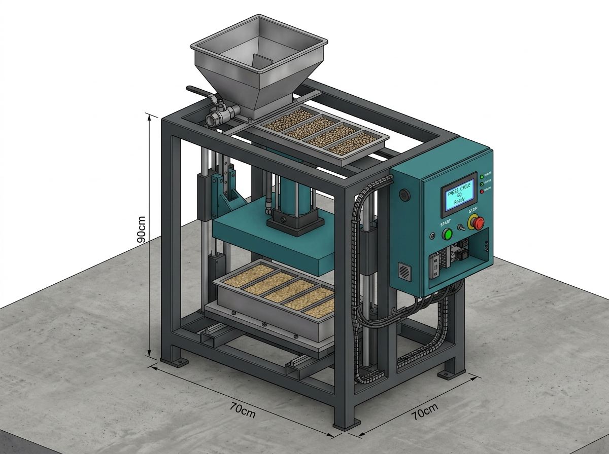
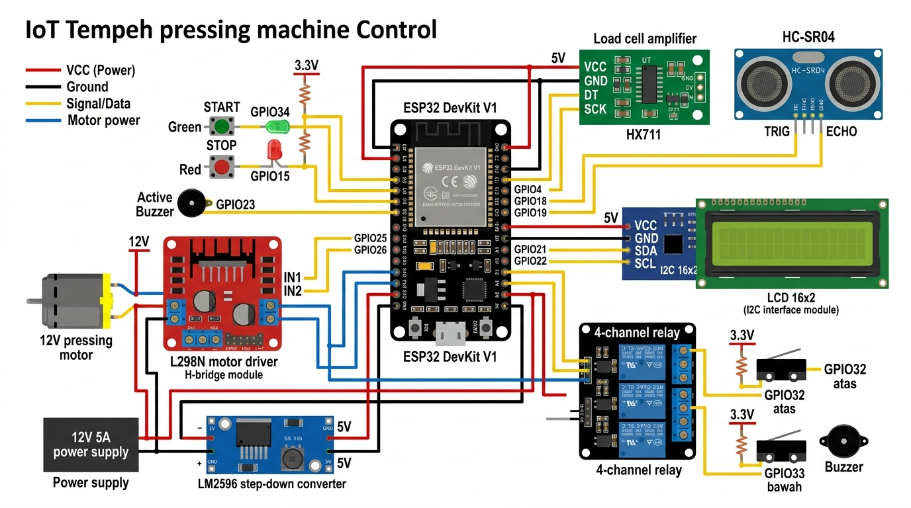

# 🫘 Mesin Pencetak Tempe Otomatis
## Dokumentasi Lengkap — Desain, Wiring, BOM & Panduan Operator

> 📁 Workspace: `c:\Users\muhib\OneDrive\Dokumen\IOT Tempe`
> 🕒 Dibuat: September 2026

---

# 🎨 BAGIAN 1 — DESAIN VISUAL MESIN

## Render 3D Mesin



### Keterangan Komponen dari Gambar

| Zona | Komponen | Keterangan |
|---|---|---|
| **Atas** | Hopper kedelai | Corong baja, volume ~10L, gate valve manual (V1) |
| **Tengah** | Kolom press + lead screw | 2 kolom besi hollow, motor DC 12V + gearbox |
| **Press plate** | Plat 44×21cm | Menekan 6 slot sekaligus, lapisan karet bawah |
| **Bawah** | Platform + cetakan 6 slot | Frame lift-off, ancak diletakkan di sini |
| **Kanan** | Panel kontrol | ESP32, LCD, tombol START/STOP, LED |
| **Kaki** | 4 kaki + leveling bolt | Baut M10 leveling, 2 roda caster belakang |

---

### Diagram Alur Mekanisme Lift-Off Frame

```
╔══════════════════════════════════════════════════════════╗
║           SIKLUS SATU PAPAN (6 TEMPE SEKALIGUS)         ║
╚══════════════════════════════════════════════════════════╝

STEP 1 — PERSIAPAN (Manual ~60 detik)
┌─────────────────────────────────────────┐
│  Platform kosong                        │
│  Operator taruh 6 ancak satu per satu  │
│  Lipat plastik 12×35 → masuk tiap slot │
│  6 plastik sudah terpasang → START      │
└─────────────────────────────────────────┘

STEP 2 — DOSING (Otomatis ~20-30 detik)
┌─────────────────────────────────────────┐
│  Gate hopper terbuka                    │
│  Kedelai + ragi mengisi 6 slot          │
│  HX711 timbang sampai target tercapai  │
│  Gate hopper menutup otomatis           │
└─────────────────────────────────────────┘

STEP 3 — PRESSING (Otomatis ~15 detik)
┌─────────────────────────────────────────┐
│  Motor turun → press plate + frame turun│
│  Frame menyentuh platform → berhenti    │
│  Press plate terus turun → tekan kedelai│
│  Tahan 5 detik (adjustable)            │
└─────────────────────────────────────────┘

STEP 4 — LIFT-OFF (Otomatis ~8 detik)
┌─────────────────────────────────────────┐
│  Motor naik → press plate naik          │
│  Frame ikut terangkat (spring coupling) │
│  6 tempe di plastik tinggal di ancak   │
│  BUZZER 2x → "6 TEMPE SIAP!"           │
└─────────────────────────────────────────┘

STEP 5 — FINISHING (Manual ~30 detik)
┌─────────────────────────────────────────┐
│  Operator ambil 6 ancak + tempe         │
│  Lipat/ikat plastik tiap tempe          │
│  Susun ke rak fermentasi                │
│  Mesin otomatis mulai siklus berikutnya │
└─────────────────────────────────────────┘
```

---

# ⚡ BAGIAN 2 — WIRING DIAGRAM

## Diagram Koneksi Lengkap



---

## Tabel Wiring Detail

### 🔌 Power Supply

```
PSU 12V 5A
  ├── (+) → L298N pin 12V        (merah, 1.5mm²)
  ├── (+) → LM2596 IN+           (merah, 1.0mm²)
  ├── (-) → L298N GND            (hitam)
  └── (-) → LM2596 IN-           (hitam)

LM2596 Step-Down (output 5V)
  ├── OUT+ → ESP32 pin VIN (5V)  (merah)
  ├── OUT+ → Relay Module VCC    (merah)
  ├── OUT+ → LCD VCC             (merah)
  └── OUT- → Semua GND bersama  (hitam)

ESP32 pin 3V3
  ├── → HX711 VCC               (merah)
  ├── → HC-SR04 VCC             (merah)
  ├── → Limit Switch (pull-up)  (merah, via resistor 10kΩ)
  └── → Tombol (pull-up)        (merah, via resistor 10kΩ)
```

### 📡 Sensor

| Komponen | Pin Sensor | ESP32 GPIO | Kabel | Catatan |
|---|---|---|---|---|
| **HX711** | VCC | 3.3V | Merah | |
| HX711 | GND | GND | Hitam | |
| HX711 | DT (DOUT) | GPIO **4** | Kuning | Data |
| HX711 | SCK | GPIO **5** | Kuning | Clock |
| **Load Cell** | E+ | HX711 E+ | Merah | Kabel sensor ke HX711 |
| Load Cell | E- | HX711 E- | Hitam | |
| Load Cell | A+ | HX711 A+ | Putih | |
| Load Cell | A- | HX711 A- | Hijau | |
| **HC-SR04** | VCC | 3.3V | Merah | |
| HC-SR04 | GND | GND | Hitam | |
| HC-SR04 | TRIG | GPIO **18** | Kuning | |
| HC-SR04 | ECHO | GPIO **19** | Kuning | Tambah resistor pembagi jika 5V |
| **Limit SW Atas** | COM | GND | Hitam | Normally Open |
| Limit SW Atas | NO | GPIO **32** | Kuning | INPUT_PULLUP di kode |
| **Limit SW Bawah** | COM | GND | Hitam | |
| Limit SW Bawah | NO | GPIO **33** | Kuning | INPUT_PULLUP di kode |

### 🖥 Display & UI

| Komponen | Pin | ESP32 GPIO | Kabel |
|---|---|---|---|
| **LCD I2C** | VCC | 5V (dari LM2596) | Merah |
| LCD I2C | GND | GND | Hitam |
| LCD I2C | SDA | GPIO **21** | Biru |
| LCD I2C | SCL | GPIO **22** | Biru |
| **Tombol START** | Pin 1 | GPIO **34** | Hijau |
| Tombol START | Pin 2 | GND | Hitam |
| **Tombol STOP** | Pin 1 | GPIO **35** | Merah |
| Tombol STOP | Pin 2 | GND | Hitam |
| **LED Hijau** | (+) | GPIO **2** | Hijau |
| LED Hijau | (-) | GND via R 220Ω | Hitam |
| **LED Merah** | (+) | GPIO **15** | Merah |
| LED Merah | (-) | GND via R 220Ω | Hitam |
| **Buzzer Aktif** | (+) | GPIO **23** | Kuning |
| Buzzer | (-) | GND | Hitam |

### ⚙ Aktuator

| Komponen | Pin | Koneksi | Kabel | Catatan |
|---|---|---|---|---|
| **L298N** | IN1 | GPIO **25** | Kuning | Motor arah 1 |
| L298N | IN2 | GPIO **26** | Kuning | Motor arah 2 |
| L298N | ENA | 5V (atau jumper) | Merah | Selalu enable |
| L298N | 12V | PSU 12V (+) | Merah tebal | |
| L298N | GND | PSU (-) + ESP GND | Hitam | Common ground! |
| L298N | OUT1 | Motor (+) | Biru | |
| L298N | OUT2 | Motor (-) | Biru | |
| **Relay Ch1** | IN1 | GPIO **27** | Kuning | Kontrol gate hopper |
| Relay | VCC | 5V | Merah | |
| Relay | GND | GND | Hitam | |
| Relay | COM | Sumber tegangan gate | — | |
| Relay | NO | Aktuator gate | — | Normally Open |

> [!WARNING]
> **PENTING — Common Ground!**
> GND dari PSU 12V, LM2596, ESP32, L298N, dan semua komponen HARUS dihubungkan ke satu titik GND bersama. Tanpa ini, sensor & motor tidak akan bekerja benar.

---

## Skema Power (Blok Diagram)

```
┌──────────────┐   12V     ┌─────────┐   12V    ┌──────────────┐
│  PSU 12V 5A  │──────────►│  L298N  │─────────►│  Motor DC    │
│              │           │ H-Bridge│           │  Press 12V   │
└──────┬───────┘           └─────────┘           └──────────────┘
       │ 12V
       ▼
┌──────────────┐   5V      ┌─────────┐   5V     ┌──────────────┐
│  LM2596      │──────────►│  ESP32  │          │  LCD + Relay │
│  Step-Down   │           │  DevKit │───3.3V──►│  HX711,SR04  │
└──────────────┘           └─────────┘           └──────────────┘
```

---

# 🛒 BAGIAN 3 — BOM & DAFTAR BELANJA

## Komponen Elektronik

| No | Nama Komponen | Spesifikasi | Qty | Estimasi Harga | Kata Kunci Cari |
|---|---|---|---|---|---|
| 1 | ESP32 DevKit V1 | 38-pin, CP2102 | 1 | Rp 55.000 | "ESP32 DevKit V1 38pin" |
| 2 | Load Cell 10kg | Bar type + HX711 module | 1 set | Rp 45.000 | "load cell 10kg HX711 set" |
| 3 | HC-SR04 | Ultrasonic distance | 1 | Rp 15.000 | "HC-SR04 ultrasonic" |
| 4 | DHT22 *(opsional)* | Temp + humidity | 1 | Rp 25.000 | "DHT22 sensor" |
| 5 | LCD 16×2 + I2C | Green backlight + I2C module | 1 set | Rp 30.000 | "LCD 1602 I2C module" |
| 6 | L298N Motor Driver | Dual H-Bridge modul | 1 | Rp 20.000 | "L298N motor driver modul" |
| 7 | Relay Module 4ch | 5V coil, 10A | 1 | Rp 25.000 | "relay module 4 channel 5V" |
| 8 | Micro Limit Switch | WITH roller lever | 4 | Rp 20.000 | "micro switch roller lever" |
| 9 | Push Button 22mm | NO, panel mount | 2 | Rp 20.000 | "push button 22mm panel" |
| 10 | LED 5mm | Hijau + Merah | 2 | Rp 5.000 | "LED 5mm hijau merah" |
| 11 | Buzzer Aktif 5V | Active buzzer | 1 | Rp 5.000 | "buzzer aktif 5V" |
| 12 | LM2596 Step-Down | DC-DC 12V→5V | 1 | Rp 15.000 | "LM2596 step down DC DC" |
| 13 | Adaptor 12V 5A | DC PSU | 1 | Rp 80.000 | "adaptor power supply 12V 5A" |
| 14 | Resistor 10kΩ | 1/4W | 5 | Rp 3.000 | "resistor 10k" |
| 15 | Resistor 220Ω | 1/4W (untuk LED) | 4 | Rp 2.000 | "resistor 220 ohm" |
| 16 | PCB Protoboard | 9×15cm | 2 | Rp 15.000 | "PCB protoboard 9x15" |
| 17 | Kabel jumper | Male-Female 20cm | 1 pak | Rp 15.000 | "kabel jumper male female" |
| 18 | Kabel serabut | 1mm² merah+hitam, 5m | — | Rp 20.000 | "kabel serabut 1mm" |
| 19 | Terminal Block | 2-pin screw, 10pcs | 2 pak | Rp 15.000 | "terminal block 2 pin" |
| 20 | Panel Box ABS | 30×20×15cm | 1 | Rp 45.000 | "box panel ABS 30x20" |
| 21 | Conduit Kabel | Ø16mm, 3 meter | — | Rp 20.000 | "conduit kabel fleksibel 16mm" |
| | | | | | |
| | **TOTAL ELEKTRONIK** | | | **~Rp 500.000** | |

## Komponen Mekanik (Beli / Tukang Las)

| No | Item | Spesifikasi | Estimasi |
|---|---|---|---|
| 1 | Motor DC 12V + Gearbox | Torsi ≥ 15 kg.cm, RPM rendah | Rp 110.000 |
| 2 | Lead Screw M10 + Nut | Panjang 20cm, pitch 1.5mm | Rp 50.000 |
| 3 | Kopling Fleksibel | Diameter 6.35mm ke 10mm | Rp 25.000 |
| 4 | Linear Bearing | LM8UU atau bushing Ø10mm | Rp 30.000 |
| 5 | Besi Siku 40×40×4mm | 6 meter | Rp 80.000 |
| 6 | Besi Hollow 40×40×3mm | 2 meter (kolom press) | Rp 40.000 |
| 7 | Plat Besi 5mm | 50×30cm (press plate + platform) | Rp 80.000 |
| 8 | Plat Besi 3mm | Untuk frame cetakan | Rp 50.000 |
| 9 | Plat Aluminium 10mm | 45×22cm (press plate atas) | Rp 120.000 |
| 10 | Karet lembaran 3mm | 45×22cm (lapisan press) | Rp 30.000 |
| 11 | Baut + Mur set | M6, M8, M10 assorted | Rp 40.000 |
| 12 | Leveling Bolt M10 | x4 kaki | Rp 20.000 |
| 13 | Caster Roda 5cm | x2 roda belakang | Rp 30.000 |
| 14 | Cat besi anti karat | 400ml spray | Rp 35.000 |
| 15 | **Jasa Tukang Las** | Frame + mold + hopper + press | Rp 300.000–400.000 |
| | **TOTAL MEKANIK** | | **~Rp 940.000–1.040.000** |

## Ringkasan Budget

| Kategori | Biaya |
|---|---|
| Elektronik | Rp 500.000 |
| Mekanik & Las | Rp 940.000–1.040.000 |
| **TOTAL** | **Rp 1.440.000–1.540.000** |

> [!NOTE]
> Total sedikit di atas budget Rp 1-2 juta, namun masih dalam range yang wajar. Bisa dihemat dengan:
> - Ganti plat aluminium press → plat besi 5mm biasa (hemat Rp 70rb)
> - Buat hopper dari ember plastik + pipa PVC (hemat Rp 50rb)
> - Negosiasi harga tukang las (target Rp 250rb jasa las)
> - Potensial hemat: **~Rp 150.000–200.000**

---

# 📋 BAGIAN 4 — PANDUAN OPERATOR (SOP KAKAK)

> *Panduan ini dibuat sesimple mungkin. Tempel di mesin agar mudah dilihat.*

---

## ✋ Sebelum Mulai — Cek Harian (2 menit)

```
□ Pastikan mesin terhubung listrik
□ Pastikan hopper terisi kedelai+ragi yang sudah siap
□ Pastikan stok plastik 12×35cm tersedia
□ Pastikan stok ancak bambu tersedia (6 per siklus)
□ LCD menyala dan menunjukkan "READY - START"
```

---

## 🟢 PROSEDUR NORMAL — Satu Siklus (6 Tempe)

### Langkah 1️⃣ — Siapkan Cetakan
```
① Taruh 6 ancak bambu di platform mesin (1 per slot)
② Ambil plastik 12×35cm → lipat jadi huruf "U" lebar 6.6cm
③ Masukkan plastik ke setiap slot (6 kantong total)
④ Pastikan plastik rapi dan tidak miring
```

### Langkah 2️⃣ — Mulai Mesin
```
① LCD menunjukkan: "READY - START"
② Tekan tombol HIJAU (START)
③ LCD akan berubah: "Cek kedelai..."
④ Jika kedelai cukup → mesin langsung lanjut ke DOSING
```

### Langkah 3️⃣ — Tunggu Proses Otomatis
```
Mesin berjalan sendiri:
  [DOSING]   → kedelai mengisi slot ± 20-30 detik
  [PRESSING] → press turun, tahan ± 10 detik
  [NAIK]     → frame terangkat ± 8 detik

  ✅ BUZZER BERBUNYI 2× → 6 tempe sudah siap!
```

### Langkah 4️⃣ — Ambil Tempe
```
① Ambil 6 ancak + tempe dari platform
② Lipat/ikat ujung plastik tiap tempe
③ Susun ke rak fermentasi
④ Mesin akan otomatis mulai siklus berikutnya!
```

---

## 🔴 CARA BERHENTI MESIN

| Situasi | Yang Harus Dilakukan |
|---|---|
| Mau istirahat sebentar | Tekan STOP → LCD "READY" → aman ditinggal |
| Kedelai habis di hopper | Mesin bunyi panjang 3× → isi hopper → tekan STOP → isi ulang → START lagi |
| Mau selesai produksi | Tekan STOP → matikan listrik di saklar panel |
| Mesin error / bunyi keras | Tekan STOP → **hubungi yang buat mesin** |

---

## ⚠ TANDA-TANDA MASALAH

| Tanda | Kemungkinan | Solusi |
|---|---|---|
| Buzzer bunyi 3× panjang | Kedelai di hopper habis | Tuang kedelai ke hopper |
| Buzzer bunyi 5× cepat | Error motor/sensor | Tekan STOP → tunggu → START lagi |
| LCD error "ERROR MEKANIK" | Motor macet | Matikan → telepon teknisi |
| Berat tidak akurat | Load cell perlu dikalibrasi | Tekan tombol "Tare" di dashboard HP |
| Tempe tidak padat | Waktu press kurang | Naikkan waktu press via dashboard |

---

## 📱 AKSES DASHBOARD (HP)

```
1. Pastikan HP terhubung ke WiFi pabrik
2. Buka browser (Chrome / Safari)
3. Ketik: http://[IP Address di LCD mesin]
   Contoh: http://192.168.1.100
4. Dashboard langsung muncul!
```

**Yang bisa dilakukan dari HP:**
- ▶ START dan ⏹ STOP mesin dari jauh
- Lihat berat dosing real-time
- Lihat counter berapa tempe yang sudah dibuat hari ini
- Ubah berat target setelah diukur
- Reset counter harian

---

## 🔧 KALIBRASI LOAD CELL (Lakukan 1× saat pertama)

```
Langkah Kalibrasi:
① Pastikan platform KOSONG (tidak ada beban)
② Buka dashboard di HP
③ Klik tombol "⟳ Tare" (pojok kiri atas)
④ Timbangan di-nol-kan
⑤ Selesai! Berat akan akurat sekarang

Lakukan tare ulang jika:
  - Berat terasa tidak akurat
  - Setelah mesin dipindah
  - Setiap pagi sebelum produksi
```

---

# 📊 BAGIAN 5 — RINGKASAN SPESIFIKASI FINAL

| Parameter | Nilai |
|---|---|
| Jumlah slot per siklus | **6 slot simultan** |
| Tinggi frame cetakan | **3.6 cm** |
| Ukuran slot | 21.3 × 6.6 cm |
| Ukuran plastik | 12 × 35 cm (berlubang) |
| Berat target per siklus | **Kosongkan dulu** — isi setelah diukur |
| Waktu tahan press | 5 detik (adjustable) |
| Estimasi waktu 1 siklus | ~2-3 menit |
| Estimasi throughput | ~20-25 siklus/jam = **120-150 tempe/jam** |
| Koneksi | WiFi 2.4GHz |
| Dashboard | Browser HP via WiFi |
| Power | 12V 5A + 5V (step-down) |

---

## 🗂 Daftar File Proyek

| File | Lokasi | Keterangan |
|---|---|---|
| [`mesin_tempe.ino`](file:///c:/Users/muhib/OneDrive/Dokumen/IOT%20Tempe/firmware/mesin_tempe/mesin_tempe.ino) | `firmware/mesin_tempe/` | Firmware ESP32 |
| [`index.html`](file:///c:/Users/muhib/OneDrive/Dokumen/IOT%20Tempe/firmware/mesin_tempe/data/index.html) | `firmware/mesin_tempe/data/` | Dashboard SPIFFS |
| `dimensi_mekanik.md` | Artifacts | Spec untuk tukang las |
| `desain_cetakan_final.md` | Artifacts | Analisis cetakan baru |
| `implementation_plan.md` | Artifacts | Plan keseluruhan |
