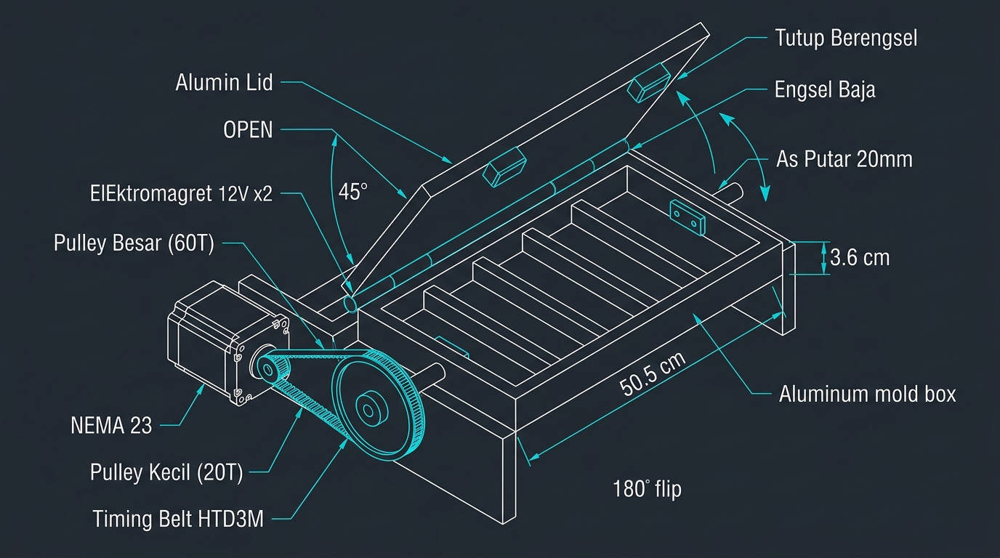
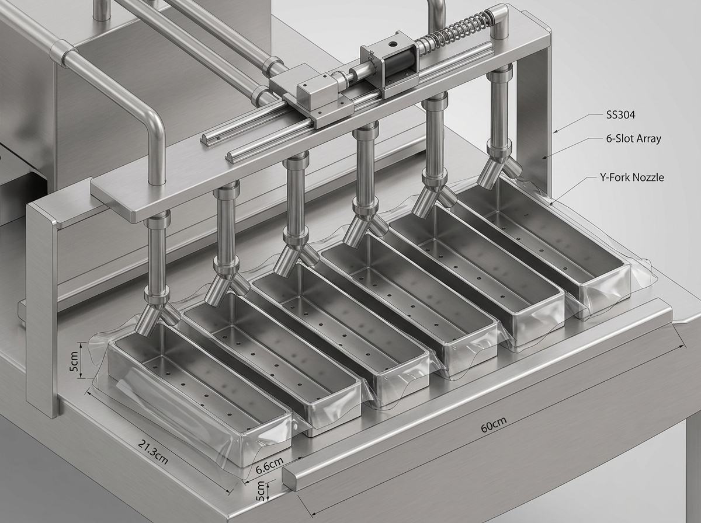
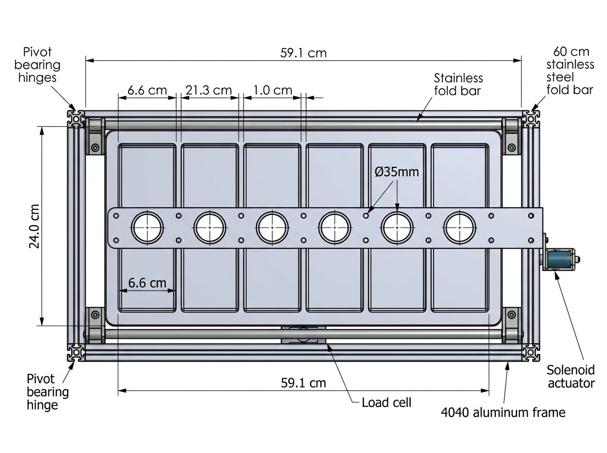

# Mesin Pencetak Tempe Semi-Otomatis — Tier 2 ESP32 WiFi
## Implementation Plan FINAL v9 — 6 SLOT SIMULTAN (FLIP 180° LEAN)
### 6 Slot Simultan, Ejeksi Rotari 180°, Tanpa Fold Bar, Tanpa HC-SR04, Tanpa LCD

> **Tanggal**: September 2026  
> **Status**: FINAL v9 — Arsitektur Mutakhir: 6 Slot Simultan dengan Mekanisme Flip Mold 180°  
> **Tier**: 2 — ESP32 WiFi + Local Web Dashboard (HTTP REST API)  
> **Perubahan Utama**:
> - Cetakan ditingkatkan menjadi **6 slot simultan** (lebar mold 59.1 cm).
> - Ejeksi tempe menggunakan **mekanisme rotasi flip 180°** (NEMA 23 + Timing Belt HTD3M 1:3 + 2× Elektromagnet 12V).
> - Mekanisme lipat plastik otomatis (*fold bar*) dihilangkan → **operator melipat manual** sebelum menekan START (menghemat biaya dan menyederhanakan mekanik).
> - Sensor ultrasonik HC-SR04 dihilangkan → **operator memantau level kedelai secara visual** (mencegah false alarm pantulan butiran).
> - Layar LCD 16×2 I2C dihilangkan → **monitoring status dialihkan ke Web Dashboard WiFi ESP32** dan feedback lokal di mesin menggunakan **LED Hijau/Merah + Buzzer**.

---

## 1. RINGKASAN SISTEM

Mesin semi-otomatis untuk mencetak tempe secara massal. Seluruh 6 slot dicetak **secara bersamaan** dalam 1 siklus produksi terpadu.

### Alur Siklus Kerja (Lean 9-State):
1. **Pemasangan Plastik:** Operator meletakkan 6 lembar plastik pembungkus ke dalam 6 slot cetakan dan melipat ujung plastik secara manual.
2. **Start Siklus:** Operator menekan tombol fisik **START** (atau tombol START pada Web Dashboard di smartphone).
3. **Pengisian Otomatis (Dosing):** Pintu geser (*gate*) corong terbuka oleh Solenoid 12V. Kedelai mengalir rata ke 6 pipa cabang nozzle Y-Fork. Load Cell 20kg membaca pertambahan berat total secara real-time. Begitu target tercapai (misal: 6 × 150g = 900g), gate tertutup seketika.
4. **Pengepresan (Pressing):** Motor DC Gearbox 12V memutar dual Lead Screw T8, menurunkan pelat penekan berpad 6 slot hingga batas limit switch bawah. Menahan tekanan selama durasi tertentu (default: 5 detik).
5. **Angkat Pelat (Lift-Off):** Pelat penekan naik kembali ke posisi atas hingga menyentuh limit switch atas.
6. **Kunci Tutup (Lock Lid):** Dua buah Solenoid Elektromagnet 12V aktif menahan tutup cetakan dengan daya tahan ≥20 kg.
7. **Pembalikan Cetakan (Rotate Mold 180°):** Motor Stepper NEMA 23 memutar cetakan 180° melalui reduksi timing belt HTD3M (2400 step). Cetakan kini terbalik tepat di atas ancak bambu penampung.
8. **Pelepasan Tempe (Unlock Lid):** Elektromagnet dimatikan sehingga tempe yang telah terbungkus plastik turun dengan mulus ke atas ancak bambu. Buzzer berbunyi 3× dan LED Hijau berkedip menandakan tempe siap diambil.
9. **Kembali ke Posisi Awal (Return Mold):** NEMA 23 memutar balik cetakan ke posisi 0°. Counter produksi bertambah (+1 batch / +6 tempe) dan mesin kembali ke status **IDLE**.

**Target Kapasitas Produksi**: ~60–75 detik per siklus (6 tempe) → **±300–360 balok tempe per jam**.

---

## 📸 DESAIN CAD & SKETSA TEKNIK

| 1. Isometric 3D View (Rotary Flip Mechanism) | 2. Detail 6-Slot Mold & Dosing Nozzle |
| :---: | :---: |
|  |  |
| *Perspektif 3D cetakan rotari dengan poros as Ø20mm, puli HTD3M 60T, dan bracket NEMA 23* | *Detail geometri cetakan 6 slot (59.1cm) dengan nozzle pengisian Y-Fork* |

| 3. Front Elevation View (Rangka 90cm) | 4. Top Plan View (Cetakan & Penekan) |
| :---: | :---: |
|  |  |
| *Tampak depan: Rangka lebar 90cm, dual lead screw T8, dan corong hopper 6 nozzle* | *Tampak atas: Tata letak cetakan 6 slot, jarak pitch 8.5cm, dan jalur transmisi motor* |

---

## 2. PERBANDINGAN EVOLUSI ARSITEKTUR

```
v8 (5-Slot Simultan, Lift-Off):       v9 (6-Slot Simultan, Rotary Flip Lean):
──────────────────────────────────     ──────────────────────────────────────────
5 Slot cetakan (lebar 50.5cm)          6 Slot cetakan (lebar 59.1cm)
4-5 Servo MG996R untuk fold bar        TIDAK ADA FOLD BAR (Operator lipat manual)
Frame Lift-Off vertikal (rawan macet)  Rotary Flip 180° (NEMA23 + Belt HTD3M 1:3)
Ejeksi manual angkat ancak             Ejeksi gravitasi langsung ke ancak bambu
Sensor ultrasonik HC-SR04 (noise)      TIDAK ADA HC-SR04 (Operator pantau visual)
Layar LCD 16×2 fisik I2C               TIDAK ADA LCD (Web Dashboard WiFi ESP32)
Siklus ~5 tempe / 60 detik             Siklus ~6 tempe / 65 detik (+20% kapasitas)
```

---

## 3. GEOMETRI CETAKAN 6-SLOT

```
TAMPAK ATAS CETAKAN STAINLESS STEEL 304 (59.1 × 24 cm):

←─────────────────────────────────── 59.1 cm ───────────────────────────────────→
┌───────────────────────────────────────────────────────────────────────────────┐
│ 6.75 │ S1: 6.6 │ 1 │ S2: 6.6 │ 1 │ S3: 6.6 │ 1 │ S4: 6.6 │ 1 │ S5: 6.6 │ 1 │ S6: 6.6 │ 6.75 │ 24 cm
│  cm  │  21.3cm │cm │  21.3cm │cm │  21.3cm │cm │  21.3cm │cm │  21.3cm │cm │  21.3cm │  cm  │
└───────────────────────────────────────────────────────────────────────────────┘
       ▲         ▲   ▲         ▲   ▲         ▲   ▲         ▲   ▲         ▲   ▲
       └─Nozzle 1─┘   └─Nozzle 2─┘   └─Nozzle 3─┘   └─Nozzle 4─┘   └─Nozzle 5─┘   └─Nozzle 6─┘
       ◄────────────── Pitch Antar Lubang Nozzle = 8.5 cm center-to-center ─────────────►
```

* **Dimensi Tiap Rongga Tempe:** Panjang 21.3 cm × Lebar 6.6 cm × Tinggi 3.6 cm (Standar ukuran balok tempe komersial ~150–200 gram).
* **Sekat Pemisah Rongga:** Plat stainless tebal 1.0 cm.
* **Margin Flange Kiri & Kanan:** Masing-masing 6.75 cm (tempat dudukan bantalan as poros Ø20mm dan bracket elektromagnet pengunci).

---

## 4. SISTEM MEKANIK & ELEKTRONIK

### 4.1 Mekanisme Dosing Kedelai (6 Nozzle Y-Fork + Load Cell)
- Corong hopper berbahan plat SS304 tebal 1.0mm dengan kapasitas 10–12 kg kedelai.
- Bagian bawah corong dilengkapi 6 cabang nozzle pipa Y-Fork (pitch 8.5 cm) yang mengarah tepat ke masing-masing slot.
- Pintu geser (*sliding gate*) digerakkan oleh Solenoid Push-Pull 12V (Relay GPIO 27).
- Sensor Load Cell Bar-Type 20kg + Modul HX711 dipasang di bawah dudukan penimbang cetakan untuk memonitor berat kumulatif secara real-time hingga mencapai nilai setpoint.

### 4.2 Mekanisme Pembalikan Rotari 180° (Flip Mold Ejection)
- **Motor Penggerak:** Stepper Motor NEMA 23 (57BYG, arus 2.8A, torsi 1.9 Nm) dikendalikan driver microstepping TB6600 4A.
- **Rasio Transmisi:** Timing Belt HTD3M menghubungkan pulley 20T (pada shaft motor Ø6.35mm) ke pulley 60T (pada as cetakan Ø20mm) → rasio reduksi 1:3.
- **Kalkulasi Langkah (Steps):**
  $$\text{Steps}_{180^\circ} = \frac{200 \text{ steps/rev} \times 8 \text{ microsteps} \times 3 \text{ (rasio)}}{2} = 2400 \text{ steps}$$
- **Poros Rotasi:** As baja stainless steel pejal Ø20mm panjang 65cm, ditumpu oleh 2 unit Pillow/Flange Bearing UCFL 204 pada kedua sisi frame.
- **Pengunci Tutup Elektromagnet:** Dua unit Solenoid Elektromagnet 12V (masing-masing tarikan 10 kg) terhubung ke Relay GPIO 13 untuk mengunci pelat penutup saat mold berputar.

### 4.3 Mekanisme Pengepresan (Dual Lead Screw T8)
- Pelat gantry penekan berbahan aluminium 5mm (panjang 59 cm) dengan 6 pad penekan.
- Digerakkan oleh 2 buah Lead Screw T8 (pitch 2mm) pada sisi kiri dan kanan untuk menjamin tekanan yang rata tanpa distorsi torsi.
- Motor penggerak: Motor DC Gearbox 12V 60RPM High Torque dengan driver L298N.
- Dilengkapi 2 sakelar mikro pembatas (Limit Switch Atas GPIO 32 dan Limit Switch Bawah GPIO 33).

### 4.4 Sistem Kendali IoT & Web Dashboard
- ESP32 bertindak sebagai Web Server mandiri (menggunakan WiFi Access Point atau koneksi router lokal).
- Antarmuka web modern (HTML5/CSS3/JavaScript) disimpan di memori internal SPIFFS.
- Menampilkan status proses real-time, grafik berat, counter produksi harian & total seumur hidup mesin.
- Menyediakan tombol kendali jarak jauh (START, STOP, Tare Timbangan, Toggle Magnet, dan Test Rotasi) serta form pengaturan target berat dan waktu tahan press.

---

## 5. DESAIN RANGKA MESIN (FRAME 90 CM)

```
TAMPAK DEPAN RANGKA (Lebar 90cm × Tinggi 130cm × Kedalaman 40cm):

┌─────────────────────────────────────────────────────────────┐
│                 [HOPPER SS304 6-NOZZLE]                     │ h = 130 cm
│                 \─────────────────────────/                 │
│                 / ○   ○   ○   ○   ○   ○ \  [SOLENOID GATE]  │
├─────────────────────────────────────────────────────────────┤ h = 100 cm
│  [LEAD SCREW]     [PELAT PRESS 6-PAD 59cm]     [LEAD SCREW] │
│       │                      ↕                      │       │ h = 85 cm
│     [BEARING]      [MOTOR DC GEARBOX 12V]        [BEARING]  │
├─────────────────────────────────────────────────────────────┤
│  [NEMA 23]                                                  │ h = 55 cm
│     │ (Belt HTD3M)                                          │
│  [PULLEY 60T] ─── [POROS AS Ø20mm + MOLD 6-SLOT] ───────────┤
│  [BEARING FLANGE]                               [BEARING FL]│
├─────────────────────────────────────────────────────────────┤ h = 30 cm
│              [DUDUKAN ANCAK BAMBU TEMPE]                    │
├─────────────────────────────────────────────────────────────┤ h = 15 cm
│             [BOX PANEL KONTROL ELEKTRONIK]                  │
└─────────────────────────────────────────────────────────────┘
```

---

## 6. BILL OF MATERIALS (BOM) v9 FINAL

### 6.1 Elektronik & Kontrol (Online Tokopedia/Shopee) — Rp 801.000
1. ESP32 DevKit V1 38-Pin — Rp 65.000
2. Load Cell 20kg Bar-Type + Modul ADC HX711 — Rp 40.000
3. Motor DC Gearbox 12V 60RPM High Torque — Rp 75.000
4. Driver Motor L298N Dual H-Bridge — Rp 22.000
5. Stepper Motor NEMA 23 57BYG (2.8A, 1.9Nm) — Rp 120.000
6. Driver Stepper TB6600 4A — Rp 65.000
7. Modul Relay 2-Channel 12V Optocoupler — Rp 18.000
8. Solenoid Elektromagnet 12V 10kg (2 unit) — Rp 80.000
9. Solenoid Push-Pull 12V (Pintu Geser Hopper) — Rp 55.000
10. Power Supply Switching 12V 10A (120W) — Rp 90.000
11. Buck Converter LM2596 Step-Down 12V ke 5V — Rp 12.000
12. Micro Limit Switch Roller Lever (4 unit) — Rp 20.000
13. Push Button Metal Momentary 16mm (3 unit) — Rp 24.000
14. Buzzer Aktif 5V — Rp 5.000
15. LED Indikator 5mm Merah & Hijau (5 unit) — Rp 5.000
16. Kapasitor Elco 470μF 25V (5 unit) — Rp 10.000
17. Resistor 10kΩ 1/4W (20 unit) — Rp 10.000
18. Kabel Jumper M-F 40cm (2 set) — Rp 40.000
19. Terminal Block PCB 2-Pin (20 unit) — Rp 20.000
20. Kotak Panel ABS 200×150×100mm — Rp 25.000

### 6.2 Bahan Mekanik & Toko Besi — Rp 1.281.000
1. Besi Hollow 40×40mm tebal 2.0mm (12 meter) — Rp 600.000
2. Poros As Baja Stainless Ø20mm panjang 65cm — Rp 60.000
3. Plat Aluminium 5mm (60×15cm) untuk Press Plate — Rp 130.000
4. Plat Aluminium 3mm (70×30cm) untuk Gate & Tutup — Rp 70.000
5. Lead Screw T8 300mm + Brass Nut (2 unit) — Rp 90.000
6. Timing Belt HTD3M lebar 15mm panjang ~700mm — Rp 35.000
7. Pulley 20T HTD3M Bore 6.35mm — Rp 20.000
8. Pulley 60T HTD3M Bore 20mm — Rp 40.000
9. Bearing Flange UCFL 204 (20mm) (2 unit) — Rp 50.000
10. Bearing 608ZZ Tumpuan Lead Screw (4 unit) — Rp 20.000
11. Shaft Coupler Fleksibel Motor ke Lead Screw — Rp 35.000
12. Engsel Baja 2 Inchi untuk Tutup Slot (12 unit) — Rp 36.000
13. Baut, Mur, dan Ring Set Komplit — Rp 50.000
14. Kaki Karet Peredam Rangka M10 (4 unit) — Rp 32.000
15. Cat Epoxy Besi Food-Safe + Thinner — Rp 43.000

### 6.3 Bengkel Las & Fabrikasi Custom SS304 — Rp 1.175.000
1. Corong Hopper Kedelai SS304 Kapasitas 12 kg — Rp 350.000
2. Nozzle Pipa Cabang Y-Fork SS304 (6 Lubang) — Rp 175.000
3. Cetakan Tempe 6-Slot SS304 (59.1×24×3.6cm) — Rp 250.000
4. Jasa Pengelasan & Perakitan Rangka Mesin — Rp 400.000

### 6.4 Rekapitulasi Anggaran Proyek
* Subtotal Belanja Online: Rp 801.000
* Subtotal Toko Besi: Rp 1.281.000
* Subtotal Bengkel Custom: Rp 1.175.000
* Biaya Cadangan / Buffer 10%: Rp 326.000
* **TOTAL INVESTASI:** **~Rp 3.583.000**

---

## 7. PIN MAPPING ESP32 (v9 FINAL LEAN)

| Pin GPIO | Tipe I/O | Komponen Terhubung | Fungsi & Keterangan |
|:--:|:--:|---|---|
| **GPIO 4** | Input | HX711 DOUT | Jalur data digital pembacaan sensor Load Cell |
| **GPIO 5** | Output | HX711 SCK | Sinyal clock pewaktuan konverter HX711 |
| **GPIO 12** | Output | TB6600 STEP | Pulsa langkah rotasi Stepper NEMA 23 |
| **GPIO 13** | Output | Relay Elektromagnet | Mengaktifkan kunci magnet tutup cetakan |
| **GPIO 14** | Output | TB6600 DIR | Arah putaran Stepper NEMA 23 (180° / Balik 0°) |
| **GPIO 25** | Output | L298N IN1 | Kendali arah Motor DC press (TURUN menekan) |
| **GPIO 26** | Output | L298N IN2 | Kendali arah Motor DC press (NAIK kembali) |
| **GPIO 27** | Output | Relay Gate Solenoid | Membuka/menutup pintu geser corong kedelai |
| **GPIO 32** | Input | Limit Switch Atas | Batas acuan awal (*homing*) & batas atas press |
| **GPIO 33** | Input | Limit Switch Bawah | Batas akhir tekanan pengepresan tempe |
| **GPIO 34** | Input | Push Button START | Tombol fisik memulai siklus produksi (*Pull-up 10k*) |
| **GPIO 35** | Input | Push Button STOP | Tombol fisik jeda darurat (*Emergency Stop*) |
| **GPIO 2** | Output | LED Hijau (OK) | Indikator standby (kedip) / proses aktif (ON) |
| **GPIO 15** | Output | LED Merah (Alarm) | Indikator kegagalan mekanik atau timeout |
| **GPIO 23** | Output | Buzzer Aktif 5V | Notifikasi suara siklus selesai (3× beep) / alarm |
| *GPIO 18* | Spare | *(Bebas)* | Sebelumnya untuk HC-SR04 TRIG (kini kosong) |
| *GPIO 19* | Spare | *(Bebas)* | Sebelumnya untuk HC-SR04 ECHO (kini kosong) |
| *GPIO 21* | Spare | *(Bebas)* | Sebelumnya untuk LCD SDA (kini kosong) |
| *GPIO 22* | Spare | *(Bebas)* | Sebelumnya untuk LCD SCL (kini kosong) |

---

## 8. FINITE STATE MACHINE (FSM v9)

```
[POWER ON]
   │
   ▼
[ST_HOMING] ────► Motor DC naik sampai Limit Switch Atas aktif
   │
   ▼
[ST_IDLE]   ◄──── LED Hijau berkedip pelan (Standby). Menunggu tombol START.
   │
   ├─► Operator tekan START (atau via Web Dashboard)
   ▼
[ST_DOSING] ────► Tare Load Cell. Relay Gate buka. Kedelai mengalir ke 6 slot.
   │              HX711 pantau berat kumulatif hingga mencapai target (misal 900g).
   │              Relay Gate tutup seketika.
   ▼
[ST_PRESSING] ──► Motor DC turun hingga Limit Switch Bawah. Tahan selama 5 detik.
   │
   ▼
[ST_LIFT_OFF] ──► Motor DC naik kembali hingga Limit Switch Atas.
   │
   ▼
[ST_LOCK_LID] ──► Relay Elektromagnet aktif menahan tutup cetakan rapat-rapat.
   │
   ▼
[ST_ROTATE_MOLD]► Stepper NEMA 23 memutar cetakan 180° (2400 step, pergerakan halus).
   │              Posisi cetakan terbalik tepat di atas ancak bambu.
   ▼
[ST_UNLOCK_LID] ─► Elektromagnet dimatikan. Tempe lepas gravitasi ke atas ancak.
   │              Buzzer bunyi 3× & LED Hijau berkedip cepat.
   ▼
[ST_RETURN_MOLD]► NEMA 23 memutar balik cetakan ke posisi awal 0°.
   │
   ▼
[ST_SELESAI] ───► Counter harian & counter total bertambah (+1 batch / +6 tempe).
   │              Kembali ke status ST_IDLE.
```

---

## 9. CHECKLIST VALIDASI SEBELUM PRODUKSI

- [ ] Beban timbangan Load Cell terkalibrasi presisi dengan deviasi < ±5 gram pada rentang 500–1000g.
- [ ] Pintu geser (*sliding gate*) membuka lancar tanpa tersangkut butiran kedelai dan menutup rapat.
- [ ] Aliran kedelai dari 6 pipa nozzle Y-Fork terbagi rata ke seluruh rongga slot cetakan.
- [ ] Tekanan pelat press merata di seluruh 6 slot dan berhenti tepat saat limit switch bawah tertekan.
- [ ] Elektromagnet mampu menahan penutup cetakan saat posisi rotasi berada di sudut 90°.
- [ ] Stepper NEMA 23 berputar tepat 180° tanpa kehilangan langkah (*loss of step*) dan kembali ke 0°.
- [ ] Tempe beserta plastik pembungkus terlepas mulus ke atas alas ancak bambu.
- [ ] Tombol STOP darurat langsung mematikan katup solenoid dan mengangkat motor press ke posisi aman.
- [ ] Web Dashboard via WiFi ESP32 dapat diakses dari browser smartphone dengan respons latensi rendah.
